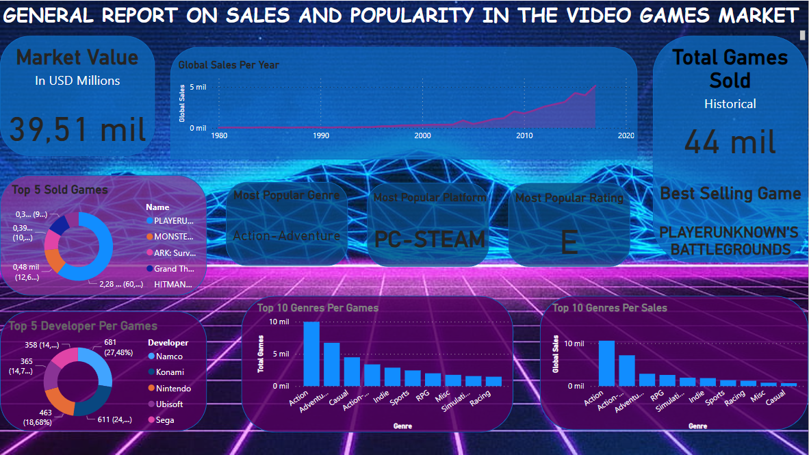
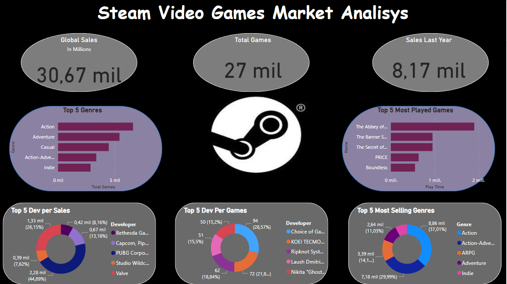
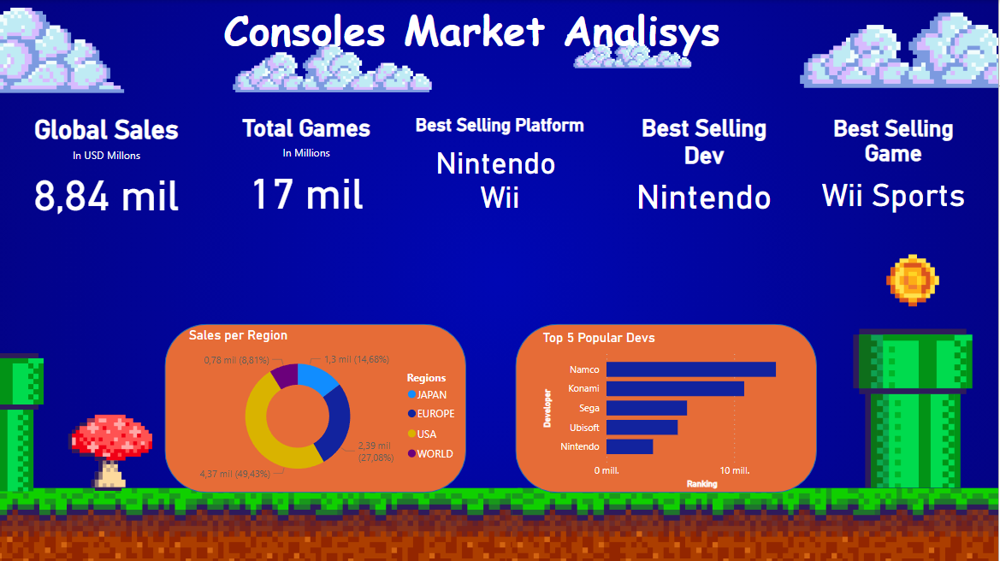

# Video Game Data Analysis
 Practice for Data Analitics

# EN: Data Analysis Project - Video Games

## Summary

This project was conducted as part of the Data Analysis bootcamp at "Soy Henry." Its primary objective is to analyze the video game market and present a report that would be of interest to potential investors in this industry. To achieve this goal, three main datasets were primarily used: "Video Game Sales," "Steam Games," and "Console Sales."

The project involved data reading and cleaning from the "Steam Games" and "Video Game Sales" tables. Data cleaning included the reduction and extraction of video game genres and the unification of age ratings for games into a single categorization. The Entertainment Software Rating Board (ESRB) rating system was used for this classification.

In addition to data cleaning, missing values in key columns for analysis were filled, such as sales data for different regions and the global sales of the games presented in the tables.

As a result, a final table was created with the following columns:

- Id_Game: Game identifier.
- Name: Game name.
- Developer: Game developer company.
- Platform: Console or platform for which the game is developed.
- Release: Release year.
- Genre: Game genre.
- Rating: Age rating (ESRB).
- Ranking: Game position based on sales and popularity.
- Average_Playtime: Average gameplay time by users.
- Score: User rating.
- NA_Sales: Sales in North America.
- EU_Sales: Sales in Europe.
- JP_Sales: Sales in Japan.
- Other_Sales: Sales in the rest of the world.
- Global_Sales: Total sales.

To facilitate the analysis in Power BI, dimensional tables were generated based on the Genre, Developer, Platform, and Rating columns. Additionally, a table that includes average playtime data and another that compiles sales by region were created. These auxiliary tables were related to the main table using identifiers.

The final result is a main table with the mentioned structure and auxiliary tables:

- developer
- platform
- genre
- rating
- games_main
- Region_Sales
- Avg_Time_Steam

The project also includes the definition of different Key Performance Indicators (KPIs) to establish the analysis objective. These KPIs were implemented in Power BI by creating measures that facilitate the visualization of solutions and results.

The analysis is presented in three main reports:

1. General Report: Provides an overview of the video game market.
   

2. Steam Platform Report: Analyzes the Steam game distribution platform.
   

3. Console Market Report: Explores the video game console market.
   

The reports were created in Power BI and compiled into a final written report in PDF format (Analysis_Report folder).

## Contact

For any inquiries or additional information, please do not hesitate to contact us through this GitHub repository.

## Credits

We extend our gratitude to the entire "Soy Henry" team and the authors of the datasets used in this project.
